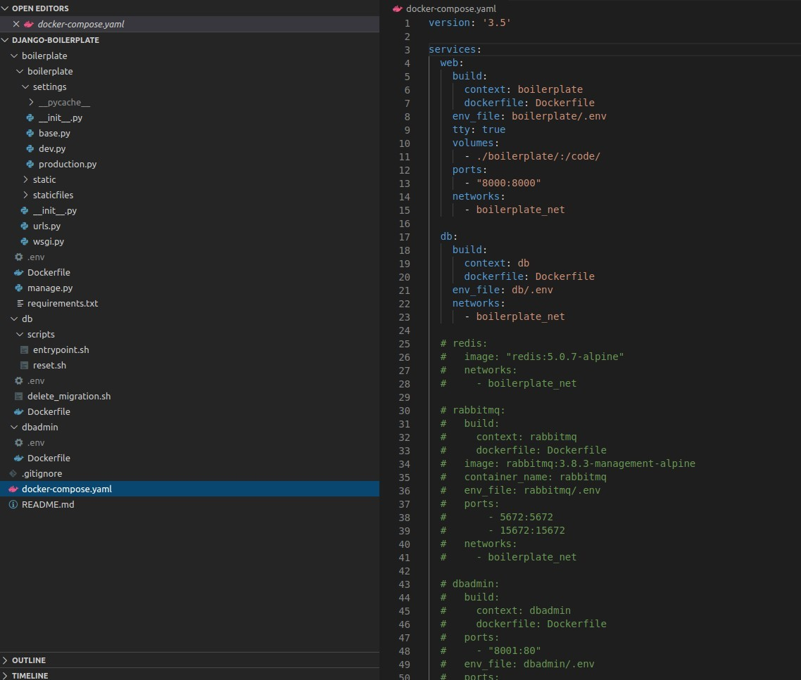

# Django Boilerplate

An opinionated Django boilerplate.




## Features

✅ Docker Compose ready

✅ Kubernetes ready

✅ Postgres ready

✅ A Dockerfile for each service

✅ Static files on S3 and CloudFront using Django Storages.

✅ A .env file for each service

✅ A base settings file with a separation between dev and prod environments 

✅ Configured to run Celery on the same container as Django using s6-overlay

✅ Configured to run Redis in a separate container 

✅ Cache configured and ready to run on disk and using Redis

✅ WSGI configured using gunicorn

✅ Other commons libraries are installed like: 

➡️ Collectfast 

➡️ django-health-check

➡️ django-select2

➡️ django_extensions

➡️ django-clear-cache

➡️ django-taggit

➡️ django-crispy-forms

➡️ django-debug-toolbar

➡️ sorl-thumbnail

➡️ django-css-inline

## How to use

1 - Install, Docker and Docker Compose.

2 - Activate your virtual env if you are using one.

3 - Run the init.sh script:


``` bash
bash init.sh <your_project_name>
```

4 - Update the .env file

5 - Run `docker-compose up`


## To Do

- Upgrade Celery.


## Contribution

All contributions are welcome.

